# wazuh-siem-windows-log-monitoring
A hands-on Wazuh SIEM lab for Windows 11 endpoint monitoring, log collection, security event analysis, and basic SOC operations.

## 📖 Project Overview

This project demonstrates the deployment and configuration of a **Wazuh SIEM environment** for centralized security monitoring and Windows endpoint log analysis.

In this lab, the **Wazuh Server** is deployed using the official Wazuh OVA on **VirtualBox**. **Kali Linux** is also deployed on VirtualBox and is used to access and manage the Wazuh Dashboard. A **Windows 11 virtual machine** is deployed using VMware Workstation and configured with the **Wazuh Agent** to forward security events and system logs to the Wazuh Server.

The main objective of this project is to understand how a SIEM platform collects, analyzes, and visualizes endpoint security data. The lab covers **Wazuh Server deployment, network configuration between VirtualBox and VMware, Windows agent enrollment, Windows Security/System/Application log collection, event monitoring, and alert analysis** through the Wazuh Dashboard.

## 🏗️ Lab Architecture

The lab environment consists of a **Wazuh Server, Kali Linux VM, and Windows 11 VM** distributed across **VirtualBox and VMware Workstation**.

* **Wazuh Server → VirtualBox → Wazuh Manager + Wazuh Indexer + Wazuh Dashboard**
* **Kali Linux → VirtualBox → Used to access and manage the Wazuh Dashboard**
* **Windows 11 → VMware Workstation → Wazuh Agent → Wazuh Server**

This project provides practical experience with **SIEM deployment, endpoint monitoring, log collection, event analysis, alert investigation, and basic SOC operations** using Wazuh.

### 🌐 Lab Network Architecture

```text
                         HOST COMPUTER
                              │
              ┌───────────────┼───────────────┐
              │               │               │
          VirtualBox      VirtualBox       VMware
              │               │               │
              ▼               ▼               ▼
        Wazuh OVA VM     Kali Linux VM    Windows 11 VM
              │               │               │
              │               │               │
              ▼               ▼               ▼
        Wazuh Server       Browser       Wazuh Agent
              │               │               │
       ┌──────┼──────┐        │               │
       │      │      │        │               │
       ▼      ▼      ▼        │               │
    Wazuh   Wazuh  Wazuh      │               │
    Manager Indexer Dashboard │               │
              ▲               │               │
              └───────────────┴───────────────┘
                         LAB NETWORK
```

The **Windows 11 Wazuh Agent** collects security-related events

## Step 1: Download the Wazuh OVA

For this project, the official **Wazuh OVA (Open Virtual Appliance)** is used to deploy the Wazuh Server in VirtualBox. The OVA provides a preconfigured virtual machine containing the required Wazuh components.

1. Open the official Wazuh Virtual Machine documentation.
2. Navigate to the **Virtual Machine (OVA)** section.
3. Download the latest available Wazuh OVA file.
4. Save the downloaded `.ova` file in an easily accessible location, such as:

```text
Downloads\Wazuh\
```

The downloaded file should have a name similar to:

```text
wazuh-4.x.x.ova
```

The exact version number may vary depending on the latest Wazuh release available at the time of deployment.


**Screenshot 1: Showing the official Wazuh OVA download page.**

**Reference:** [Official Wazuh Virtual Machine Documentation](https://documentation.wazuh.com/current/deployment-options/virtual-machine/virtual-machine.html)

## Step 2: Import the Wazuh OVA into VirtualBox

After downloading the official Wazuh OVA, the next step is to import the appliance into **Oracle VM VirtualBox**. This creates the virtual machine that will be used as the **Wazuh Server**.

### 2.1 Open VirtualBox

Open **Oracle VM VirtualBox** on the host computer.

### 2.2 Start the Import

1. Open **Oracle VM VirtualBox**.
2. Click **File** from the top menu.
3. Select **Import Appliance**.
4. The **Import Appliance** window will open.
5. Click the **File** field and browse to the location where the Wazuh OVA was downloaded.
6. Select the downloaded **`.ova`** file.
7. Click **Next** to continue.

### 2.3 Review the Appliance Settings

VirtualBox will read the OVA file and display the virtual machine configuration contained in the appliance.

The Wazuh appliance may display settings similar to:

* **CPU:** 4 cores
* **RAM:** 8 GB
* **Disk:** Approximately 50 GB
* **Network Adapter:** Configured according to the appliance

The exact settings may vary depending on the Wazuh OVA version.

Review the displayed configuration and click **Finish** to begin importing the appliance.

The import process may take several minutes depending on the performance of the host computer.

### 2.4 Verify the Virtual Machine

Once the import process is completed, return to the **VirtualBox Manager**.

A new virtual machine named **Wazuh** should now be visible in the list of available virtual machines.


**Screenshot 2:** Showing the **Wazuh virtual machine successfully added to VirtualBox**.

## Step 3: Configure the Wazuh Server Network

In this project, the following network configuration is used:

* **Wazuh Server:** VirtualBox → Bridged Adapter
* **Kali Linux:** VirtualBox → Bridged Adapter
* **Windows 11:** VMware Workstation → NAT

The **Wazuh Server** and **Kali Linux** are configured with a **Bridged Adapter**, allowing them to connect to the same physical network as the host computer. The **Windows 11 VM** is configured with **NAT** in VMware Workstation.

### 3.1 Configure the Wazuh Server

1. Open **Oracle VM VirtualBox**.
2. Select the **Wazuh** virtual machine.
3. Click **Settings → Network**.
4. Select **Adapter 1**.
5. Enable **Network Adapter**.
6. Set **Attached to** as **Bridged Adapter**.
7. Select the physical network adapter currently used by the host computer.
8. Make sure **Cable Connected** is enabled.
9. Click **OK** to save the settings.

### 3.2 Configure Kali Linux

1. Open the **Kali Linux VM settings** in VirtualBox.
2. Go to **Settings → Network**.
3. Select **Adapter 1**.
4. Set **Attached to** as **Bridged Adapter**.
5. Select the same physical network adapter used by the Wazuh VM.
6. Make sure **Cable Connected** is enabled.
7. Click **OK** to save the settings.

### 3.3 Configure Windows 11 Network

Keep the **Windows 11 VMware VM** configured as **NAT**.

The Windows 11 network connection will be tested later to verify that the Windows VM can communicate with the Wazuh Server.

### 3.4 Network Architecture

```text
                       Physical Network
                              │
                 ┌────────────┴────────────┐
                 │                         │
             VirtualBox                 VMware
                 │                         │
          ┌──────┴──────┐                  │
          │             │                  │
        Wazuh          Kali            Windows 11
        Server         Linux           Wazuh Agent
          │             │                  │
          └──────┬──────┘                  │
              Bridged                     NAT
```

## Step 4: Start the Wazuh Server and Find Its IP Address

After configuring the Wazuh VM with **Bridged Adapter**, start the virtual machine and identify the IP address assigned to the Wazuh Server.

### 4.1 Start the Wazuh Server

1. Open **Oracle VM VirtualBox**.
2. Select the **Wazuh** virtual machine.
3. Click **Start**.
4. Wait for the VM to finish booting.


**Screenshot 3:** Showing the **Wazuh VM running in VirtualBox**.

### 4.2 Log in to the Wazuh Server

Log in to the **Wazuh Server** using the credentials provided with the Wazuh OVA.

The username and password used for the login are shown in the screenshot below.

> **Security Note:** Do not publish the actual Wazuh password in a public GitHub repository. If credentials are visible in the screenshot, mask or blur the password before uploading it.


**Screenshot 4:** Showing the **Wazuh Server login username and password**.

### 4.3 Find the IP Address

After logging in, run the following command:

```bash
ip addr
```

Find the **`inet`** address listed under the active network interface.

In this example, the Wazuh Server IP address is:

```text
192.168.43.155
```

The IP address will be different depending on the local network.

**Important:** Do not use `127.0.0.1`, as this is the localhost address. Use the IP address assigned to the Wazuh Server's active network interface.


**Screenshot 5:** Showing the Wazuh Server terminal with the IP address displayed using the `ip addr` command.

## Step 5: Verify Connectivity from Kali Linux to the Wazuh Server

Before continuing with the Wazuh setup, verify that **Kali Linux can communicate with the Wazuh Server** over the network.

### 5.1 Start Kali Linux

1. Open **Oracle VM VirtualBox**.
2. Select the **Kali Linux** virtual machine.
3. Click **Start**.
4. Log in to Kali Linux.

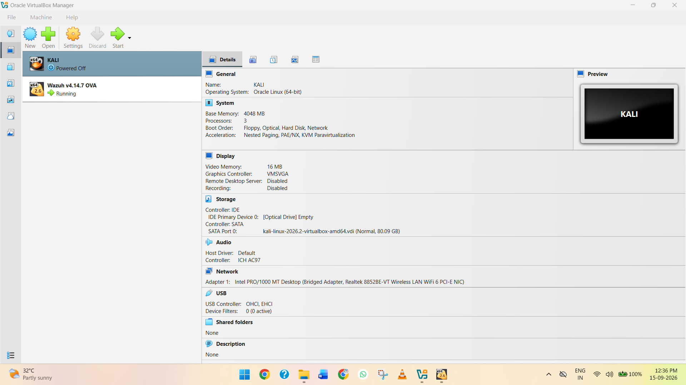

**Screenshot 6:** Showing the Kali Linux VM running in VirtualBox.

### 5.2 Check the Kali Linux IP Address

Open a terminal in Kali Linux and run:

```bash
ifconfig
```

Find the **`inet`** address of the active network interface.

In this setup, the Kali Linux IP address is:

```text
192.168.43.18
```

The Wazuh Server IP address is:

```text
192.168.43.155
```

Both systems are connected to the **192.168.43.0/24** network, allowing them to communicate with each other.

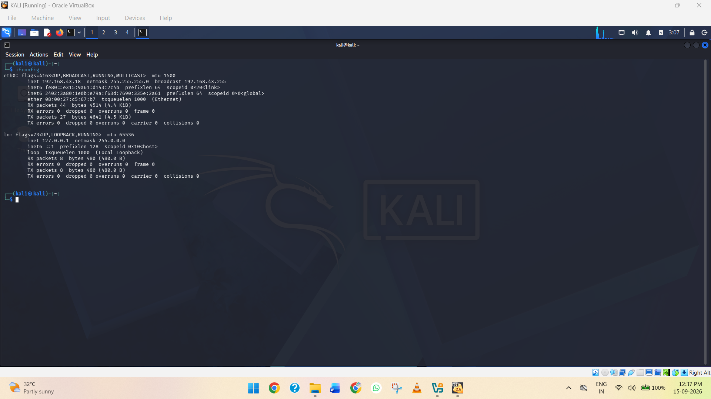

**Screenshot 7:** Showing the Kali Linux IP address.

### 5.3 Ping the Wazuh Server

To verify network connectivity, run the following command in the Kali Linux terminal:

```bash
ping -c 4 192.168.43.155
```

If the connection is working correctly, Kali Linux should receive replies from the Wazuh Server, similar to:

```text
64 bytes from 192.168.43.155: icmp_seq=1 ttl=64 time=...
64 bytes from 192.168.43.155: icmp_seq=2 ttl=64 time=...
64 bytes from 192.168.43.155: icmp_seq=3 ttl=64 time=...
64 bytes from 192.168.43.155: icmp_seq=4 ttl=64 time=...
```

Successful ping responses confirm that **Kali Linux can communicate with the Wazuh Server** over the network.

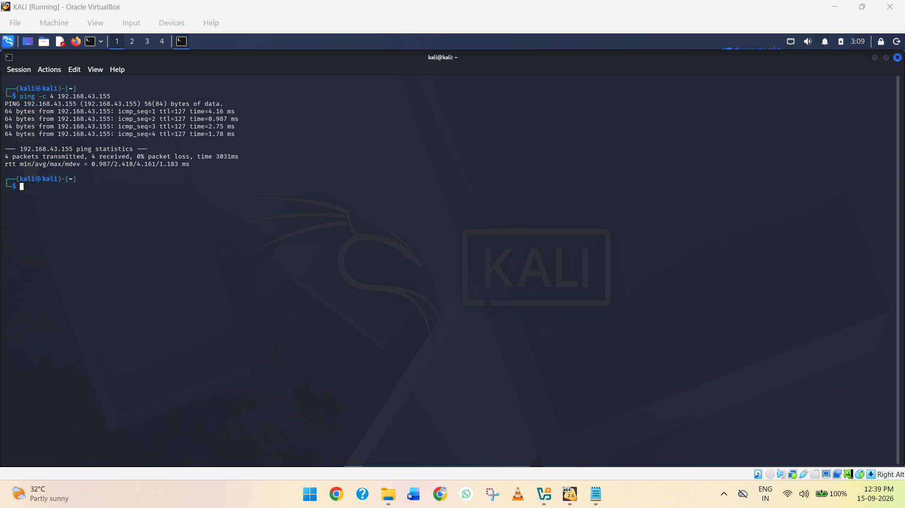

**Screenshot 8:** Showing successful ping responses from the Wazuh Server.

## Step 6: Access the Wazuh Dashboard from Kali Linux

After confirming network connectivity between Kali Linux and the Wazuh Server, the next step is to access the **Wazuh Dashboard** through a web browser.

### 6.1 Open the Browser

1. Open **Firefox** in Kali Linux.
2. Enter the following address in the address bar:

```text
https://192.168.43.155
```

3. Press **Enter**.

### 6.2 Accept the Security Warning

Because the Wazuh Dashboard uses HTTPS with a self-signed certificate, Firefox may display a warning such as:

**"Warning: Potential Security Risk Ahead"**

If the warning appears:

1. Click **Advanced**.
2. Click **Accept the Risk and Continue**.

### 6.3 Log in to Wazuh

The **Wazuh login page** should now appear.

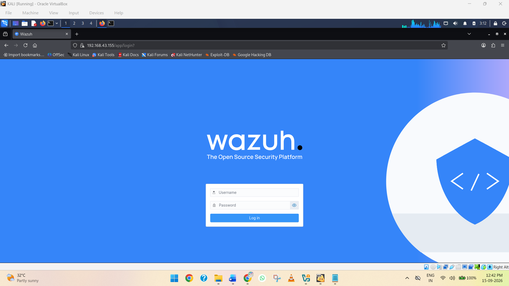

**Screenshot 9:** Showing the Wazuh login page.

Enter the Wazuh login credentials provided with the OVA installation.

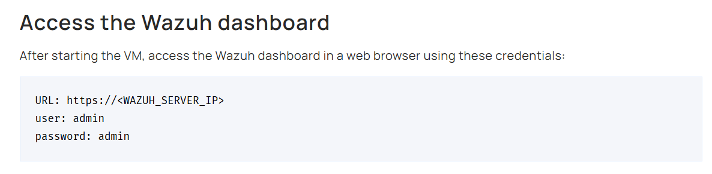

**Screenshot 10:** Showing the Wazuh login credentials.

After successful authentication, the **Wazuh Dashboard** will be displayed.

## Step 7: Verify Wazuh Services

After accessing the Wazuh Dashboard from Kali Linux, the next step is to verify that the main Wazuh services are running correctly before connecting the Windows 11 endpoint.

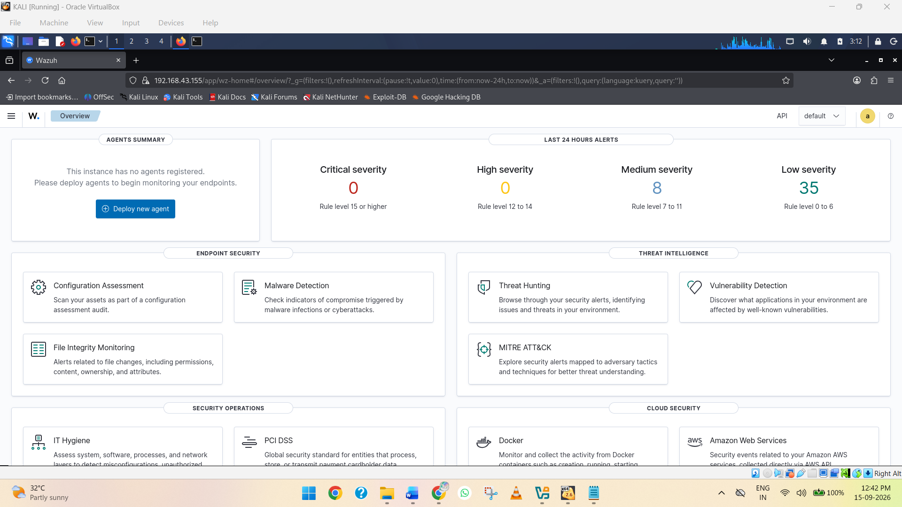

**Screenshot 11:** Showing the **Wazuh Dashboard**.

### 7.1 Open the Wazuh Server Terminal

1. Open the **Wazuh Server VM** in VirtualBox.
2. Log in to the Wazuh Server.

### 7.2 Check the Wazuh Manager

Run the following command:

```bash
sudo systemctl status wazuh-manager
```

The service should show:

```text
Active: active (running)
```

Press **Q** to exit the status screen.

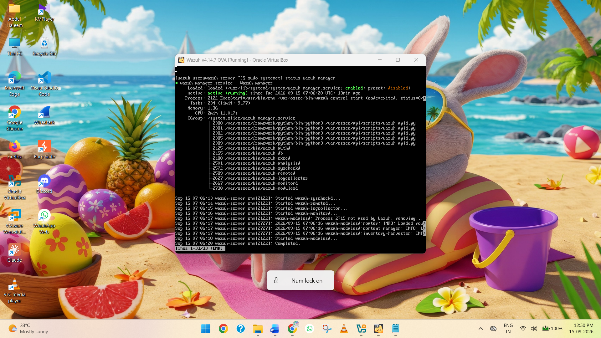

**Screenshot 12:** Showing the **Wazuh Manager** service with an active running status.

### 7.3 Check the Wazuh Indexer

Run:

```bash
sudo systemctl status wazuh-indexer
```

The service should also show:

```text
Active: active (running)
```

Press **Q** to exit the status screen.

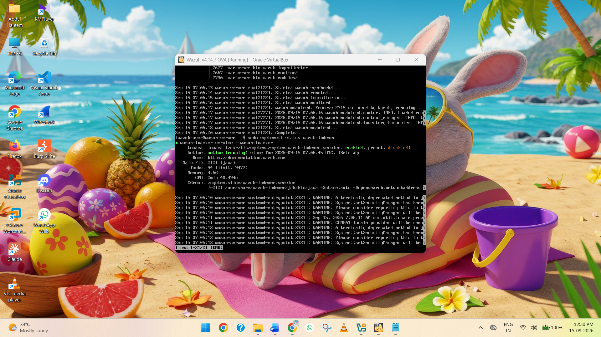

**Screenshot 13:** Showing the **Wazuh Indexer** service with an active running status.

### 7.4 Check the Wazuh Dashboard

Finally, check the **Wazuh Dashboard** service by running:

```bash
sudo systemctl status wazuh-dashboard
```

The service should show:

```text
Active: active (running)
```

Press **Q** to exit the status screen.

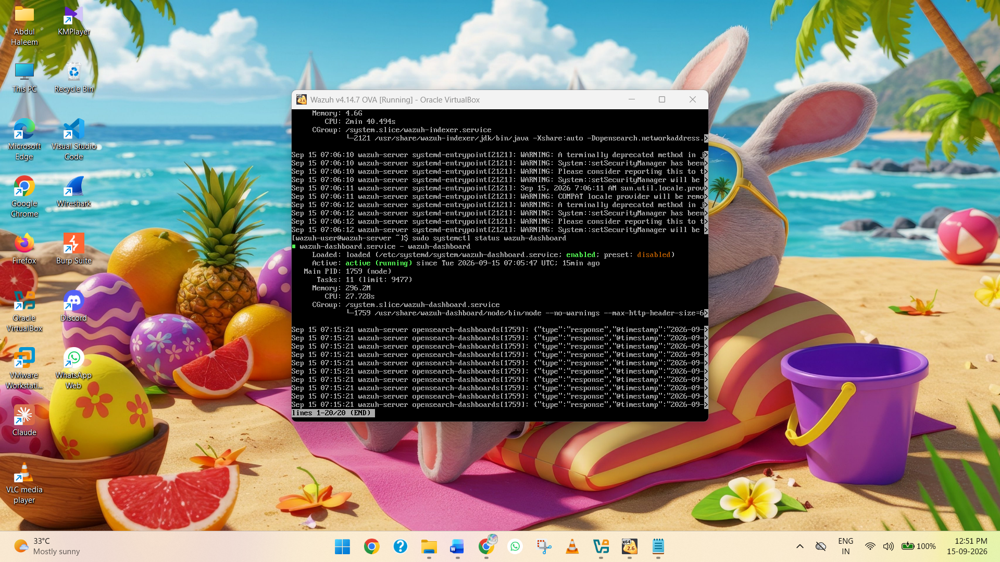

**Screenshot 14:** Showing the **Wazuh Dashboard** service with an active running status.

At this stage, the **Wazuh Manager, Wazuh Indexer, and Wazuh Dashboard** services should all be running correctly.

### Service Verification Summary

The following Wazuh services were verified as running successfully:

| Wazuh Service       | Status             |
| ------------------- | ------------------ |
| **Wazuh Manager**   | `active (running)` |
| **Wazuh Indexer**   | `active (running)` |
| **Wazuh Dashboard** | `active (running)` |

Since the **Wazuh Dashboard** was successfully accessed from Kali Linux, the Dashboard service and network connectivity between Kali Linux and the Wazuh Server have also been confirmed.

At this stage, the Wazuh Server is ready for the **Windows 11 endpoint integration**.

## Step 8: Check Windows 11 → Wazuh Server Connectivity

Before installing the Wazuh Agent, verify that the **Windows 11 VM** can communicate with the **Wazuh Server**.

The Windows 11 VM is running on **VMware Workstation using NAT**, while the Wazuh Server is connected through a **VirtualBox Bridged Adapter**.

### 8.1 Start Windows 11

1. Open **VMware Workstation**.
2. Start the **Windows 11** virtual machine.
3. Log in to Windows 11.
4. Make sure the VM has an active network connection.

**Screenshot 15:** Showing the Windows 11 VM running in VMware Workstation.

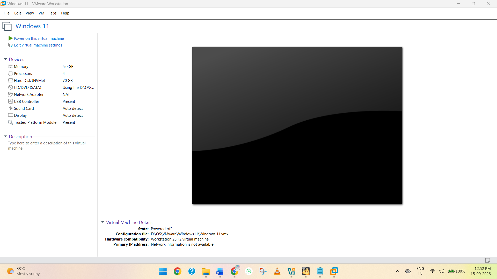

### 8.2 Find the Windows 11 IP Address

1. Open **Command Prompt** in Windows 11.
2. Run:

```cmd id="6m5w7b"
ipconfig
```

3. Find the **IPv4 Address** under the active network adapter.

The IPv4 address may look similar to:

```text id="8w8qtd"
IPv4 Address. . . . . . : 192.168.xxx.xxx
```

**Screenshot 16:** Showing the Windows 11 IPv4 address.

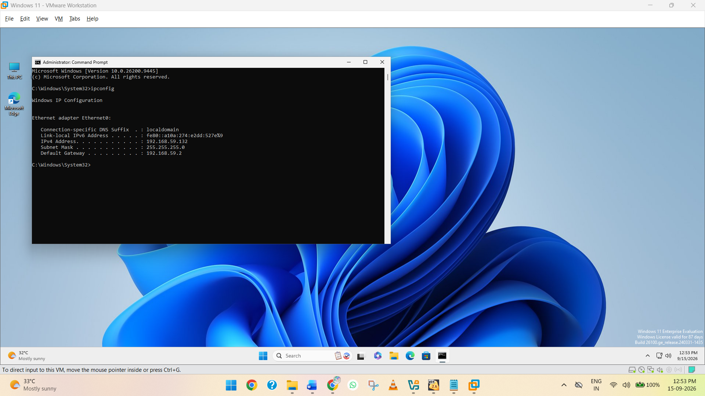

### 8.3 Test Connectivity to the Wazuh Server

In the same Command Prompt, run:

```cmd id="6x8l5a"
ping 192.168.43.155
```

If Windows 11 can reach the Wazuh Server, you should receive replies similar to:

```text id="1o5vax"
Reply from 192.168.43.155: bytes=32 time<1ms TTL=...
Reply from 192.168.43.155: bytes=32 time<1ms TTL=...
Reply from 192.168.43.155: bytes=32 time<1ms TTL=...
Reply from 192.168.43.155: bytes=32 time<1ms TTL=...
```

**Screenshot 17:** Showing successful ping responses from the Wazuh Server.


Successful ping responses confirm that **Windows 11 can communicate with the Wazuh Server** over the network.

### Network Connectivity

```text id="f2q0az"
Windows 11 VM
     │
     │  Ping
     ▼
Wazuh Server
192.168.43.155
```

## Step 9: Download and Install the Wazuh Agent for Windows 11

After confirming connectivity between Windows 11 and the Wazuh Server, the next step is to download and install the **Wazuh Agent** on the Windows 11 VM.

### 9.1 Open the Wazuh Dashboard

From **Kali Linux**, open the Wazuh Dashboard:

```text
https://192.168.43.155
```

Log in to the Wazuh Dashboard.

### 9.2 Open Agent Deployment

In the Wazuh Dashboard, navigate to:

**Agents Management → Summary**

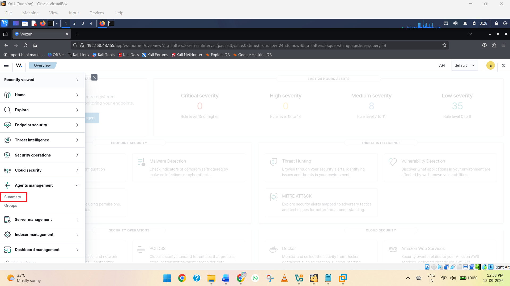

**Screenshot 18:** Showing the **Agents Management → Summary** page.

Click **Deploy new agent**.

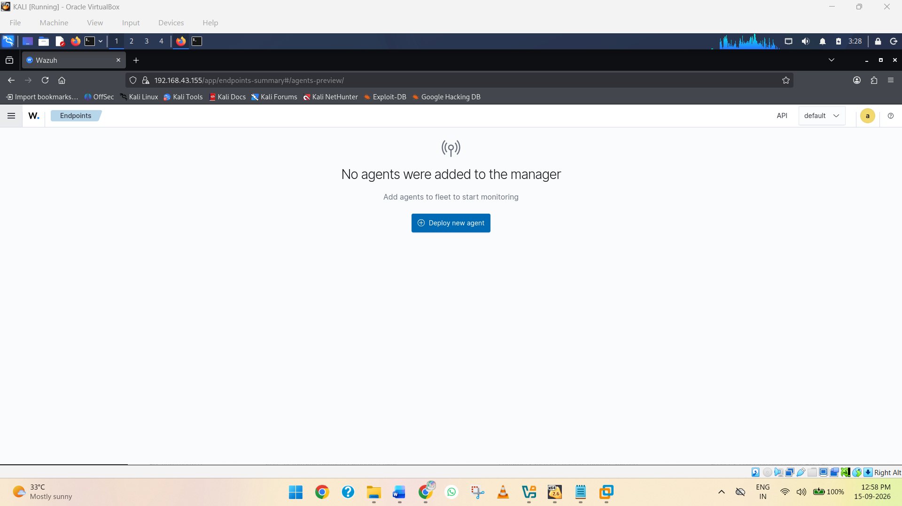

**Screenshot 19:** Showing the **Deploy new agent** option.

### 9.3 Configure the Windows Agent

In the agent deployment section, select the following options:

* **Operating System:** Windows
* **Architecture:** x86_64
* **Server Address:** `192.168.43.155`
* **Agent Name:** `Windows-11-SOC-Lab`

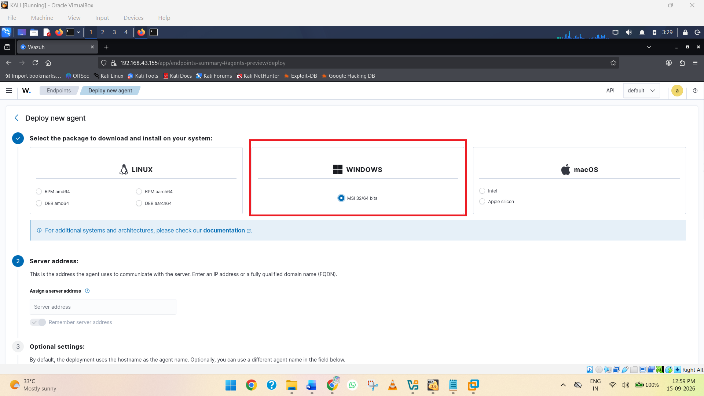

**Screenshot 20:** Showing the Windows operating system selection.

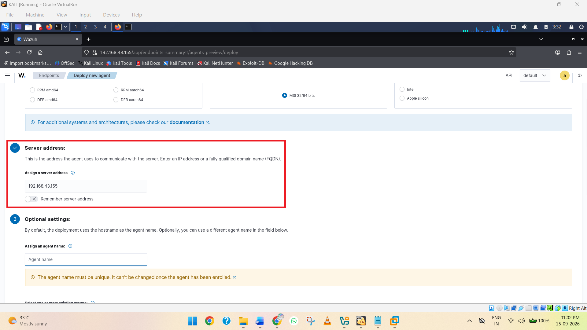

**Screenshot 21:** Showing the configured server address and agent architecture.

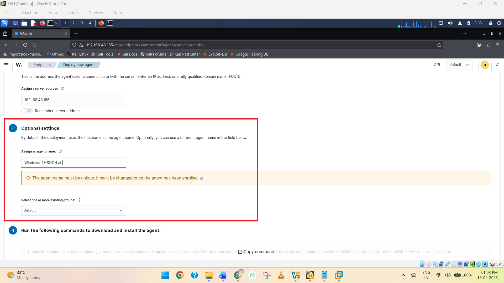

**Screenshot 22:** Showing the configured agent name.

### 9.4 Copy the Installation Command

The Wazuh Dashboard generates an installation command based on the selected configuration.

For this setup, the generated command is:

```powershell
Invoke-WebRequest -Uri https://packages.wazuh.com/4.x/windows/wazuh-agent-4.14.7-1.msi -OutFile $env:tmp\wazuh-agent; msiexec.exe /i $env:tmp\wazuh-agent /q WAZUH_MANAGER='192.168.43.155' WAZUH_AGENT_NAME='Windows-11-SOC-Lab'
```

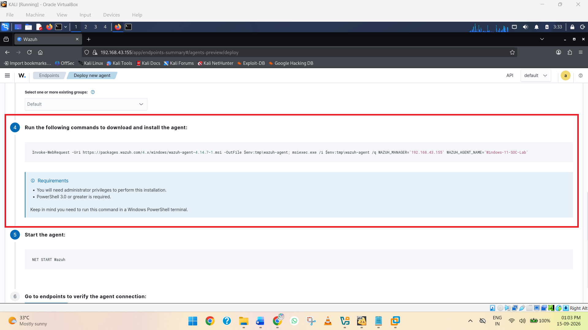

**Screenshot 23:** Showing the generated Wazuh Agent installation command.

### 9.5 Open PowerShell as Administrator

On the Windows 11 VM:

1. Click **Start**.
2. Search for **PowerShell**.
3. Right-click **Windows PowerShell**.
4. Select **Run as administrator**.
5. Click **Yes** if the **User Account Control** prompt appears.

### 9.6 Download and Install the Agent

Paste the generated command into **Administrator PowerShell**:

```powershell
Invoke-WebRequest -Uri https://packages.wazuh.com/4.x/windows/wazuh-agent-4.14.7-1.msi -OutFile $env:tmp\wazuh-agent; msiexec.exe /i $env:tmp\wazuh-agent /q WAZUH_MANAGER='192.168.43.155' WAZUH_AGENT_NAME='Windows-11-SOC-Lab'
```

Press **Enter**.

The command will:

1. Download the **Wazuh Agent 4.14.7** installer.
2. Save the installer in the Windows temporary directory.
3. Install the Wazuh Agent silently.
4. Configure the Wazuh Manager address as **192.168.43.155**.
5. Configure the agent name as **Windows-11-SOC-Lab**.

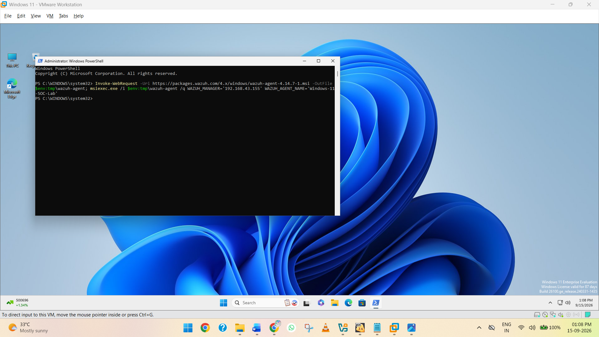

**Screenshot 24:** Showing the Wazuh Agent installation command being executed in Administrator PowerShell.

### 9.7 Verify the Installation

After the installation is complete, verify that the Wazuh Agent service exists by running:

```powershell
Get-Service WazuhSvc
```

You should see output similar to:

```text
Status   Name       DisplayName
------   ----       -----------
Stopped  WazuhSvc   Wazuh Agent
```

The **Stopped** status at this stage is expected because the agent has been installed but has not yet been started.


**Screenshot 25:** Showing the installed **Wazuh Agent (`WazuhSvc`)** service.
