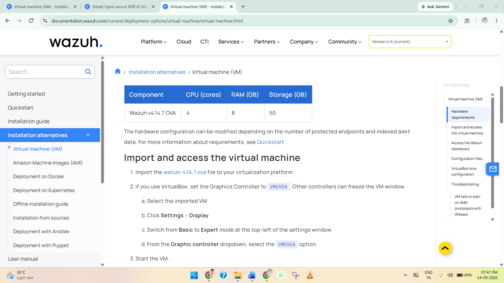

# wazuh-siem-windows-log-monitoring
A hands-on Wazuh SIEM lab for Windows 11 endpoint monitoring, log collection, security event analysis, and basic SOC operations.

## 📖 Project Overview

This project demonstrates the deployment and configuration of a **Wazuh SIEM environment** for centralized security monitoring and Windows endpoint log analysis.

In this lab, the **Wazuh Server** is deployed using the official Wazuh OVA on **VirtualBox**. **Kali Linux** is also deployed on VirtualBox and is used to access and manage the Wazuh Dashboard. A **Windows 11 virtual machine** is deployed using VMware Workstation and configured with the **Wazuh Agent** to forward security events and system logs to the Wazuh Server.

The main objective of this project is to understand how a SIEM platform collects, analyzes, and visualizes endpoint security data. The lab covers **Wazuh Server deployment, network configuration between VirtualBox and VMware, Windows agent enrollment, Windows Security/System/Application log collection, event monitoring, and alert analysis** through the Wazuh Dashboard.

## 🏗️ Lab Architecture

The lab environment consists of a **Wazuh Server, Kali Linux VM, and Windows 11 VM** distributed across **VirtualBox and VMware Workstation**.

* **Wazuh Server → VirtualBox → Wazuh Manager + Wazuh Indexer + Wazuh Dashboard**
* **Kali Linux → VirtualBox → Used to access and manage the Wazuh Dashboard**
* **Windows 11 → VMware Workstation → Wazuh Agent → Wazuh Server**

This project provides practical experience with **SIEM deployment, endpoint monitoring, log collection, event analysis, alert investigation, and basic SOC operations** using Wazuh.

### 🌐 Lab Network Architecture

```text
                         HOST COMPUTER
                              │
              ┌───────────────┼───────────────┐
              │               │               │
          VirtualBox      VirtualBox       VMware
              │               │               │
              ▼               ▼               ▼
        Wazuh OVA VM     Kali Linux VM    Windows 11 VM
              │               │               │
              │               │               │
              ▼               ▼               ▼
        Wazuh Server       Browser       Wazuh Agent
              │               │               │
       ┌──────┼──────┐        │               │
       │      │      │        │               │
       ▼      ▼      ▼        │               │
    Wazuh   Wazuh  Wazuh      │               │
    Manager Indexer Dashboard │               │
              ▲               │               │
              └───────────────┴───────────────┘
                         LAB NETWORK
```

The **Windows 11 Wazuh Agent** collects security-related events

## Step 1: Download the Wazuh OVA

For this project, the official **Wazuh OVA (Open Virtual Appliance)** is used to deploy the Wazuh Server in VirtualBox. The OVA provides a preconfigured virtual machine containing the required Wazuh components.

1. Open the official Wazuh Virtual Machine documentation.
2. Navigate to the **Virtual Machine (OVA)** section.
3. Download the latest available Wazuh OVA file.
4. Save the downloaded `.ova` file in an easily accessible location, such as:

```text
Downloads\Wazuh\
```

The downloaded file should have a name similar to:

```text
wazuh-4.x.x.ova
```

The exact version number may vary depending on the latest Wazuh release available at the time of deployment.



**Screenshot 1: Showing the official Wazuh OVA download page.**

**Reference:** [Official Wazuh Virtual Machine Documentation](https://documentation.wazuh.com/current/deployment-options/virtual-machine/virtual-machine.html)
