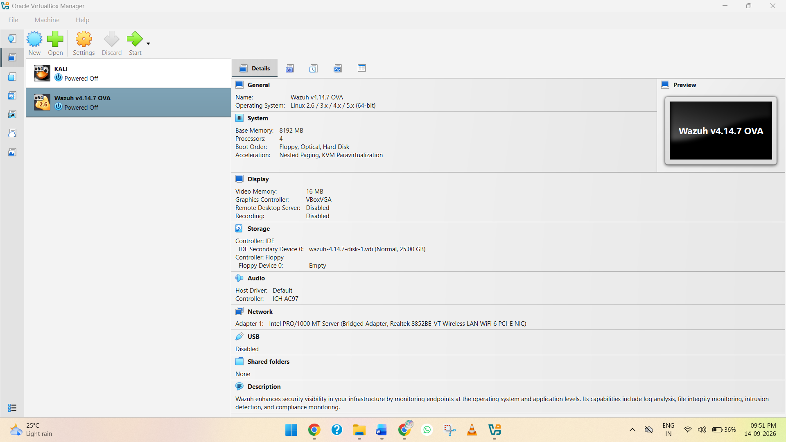
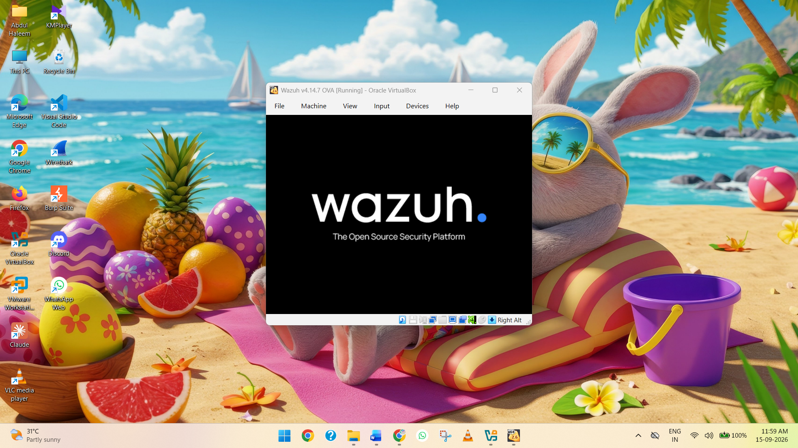
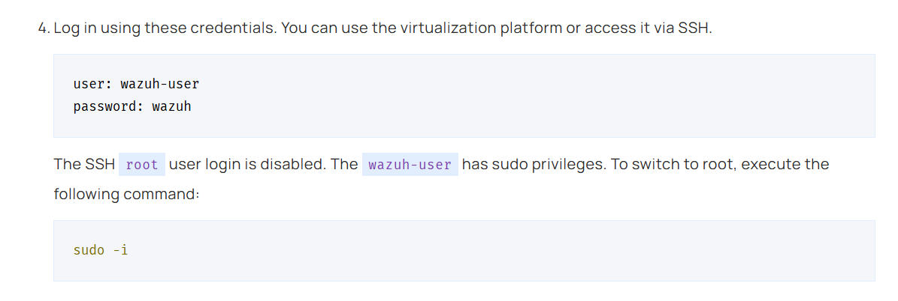
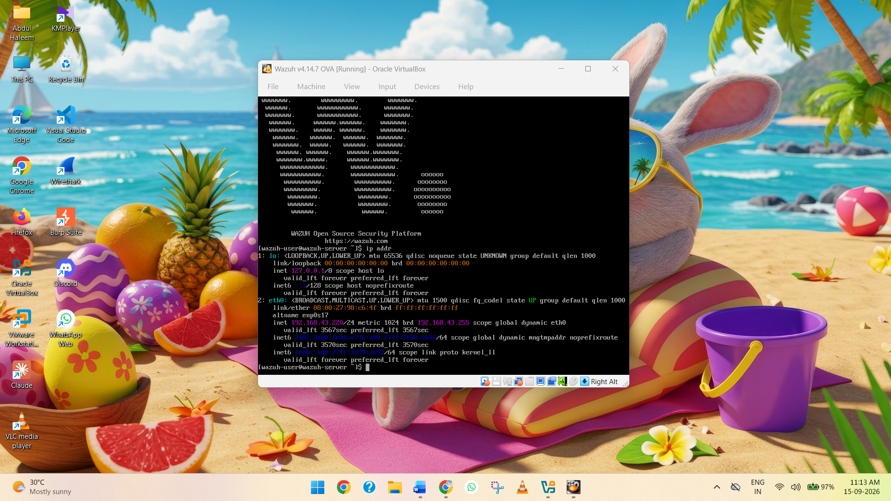

# wazuh-siem-windows-log-monitoring
A hands-on Wazuh SIEM lab for Windows 11 endpoint monitoring, log collection, security event analysis, and basic SOC operations.

## 📖 Project Overview

This project demonstrates the deployment and configuration of a **Wazuh SIEM environment** for centralized security monitoring and Windows endpoint log analysis.

In this lab, the **Wazuh Server** is deployed using the official Wazuh OVA on **VirtualBox**. **Kali Linux** is also deployed on VirtualBox and is used to access and manage the Wazuh Dashboard. A **Windows 11 virtual machine** is deployed using VMware Workstation and configured with the **Wazuh Agent** to forward security events and system logs to the Wazuh Server.

The main objective of this project is to understand how a SIEM platform collects, analyzes, and visualizes endpoint security data. The lab covers **Wazuh Server deployment, network configuration between VirtualBox and VMware, Windows agent enrollment, Windows Security/System/Application log collection, event monitoring, and alert analysis** through the Wazuh Dashboard.

## 🏗️ Lab Architecture

The lab environment consists of a **Wazuh Server, Kali Linux VM, and Windows 11 VM** distributed across **VirtualBox and VMware Workstation**.

* **Wazuh Server → VirtualBox → Wazuh Manager + Wazuh Indexer + Wazuh Dashboard**
* **Kali Linux → VirtualBox → Used to access and manage the Wazuh Dashboard**
* **Windows 11 → VMware Workstation → Wazuh Agent → Wazuh Server**

This project provides practical experience with **SIEM deployment, endpoint monitoring, log collection, event analysis, alert investigation, and basic SOC operations** using Wazuh.

### 🌐 Lab Network Architecture

```text
                         HOST COMPUTER
                              │
              ┌───────────────┼───────────────┐
              │               │               │
          VirtualBox      VirtualBox       VMware
              │               │               │
              ▼               ▼               ▼
        Wazuh OVA VM     Kali Linux VM    Windows 11 VM
              │               │               │
              │               │               │
              ▼               ▼               ▼
        Wazuh Server       Browser       Wazuh Agent
              │               │               │
       ┌──────┼──────┐        │               │
       │      │      │        │               │
       ▼      ▼      ▼        │               │
    Wazuh   Wazuh  Wazuh      │               │
    Manager Indexer Dashboard │               │
              ▲               │               │
              └───────────────┴───────────────┘
                         LAB NETWORK
```

The **Windows 11 Wazuh Agent** collects security-related events

## Step 1: Download the Wazuh OVA

For this project, the official **Wazuh OVA (Open Virtual Appliance)** is used to deploy the Wazuh Server in VirtualBox. The OVA provides a preconfigured virtual machine containing the required Wazuh components.

1. Open the official Wazuh Virtual Machine documentation.
2. Navigate to the **Virtual Machine (OVA)** section.
3. Download the latest available Wazuh OVA file.
4. Save the downloaded `.ova` file in an easily accessible location, such as:

```text
Downloads\Wazuh\
```

The downloaded file should have a name similar to:

```text
wazuh-4.x.x.ova
```

The exact version number may vary depending on the latest Wazuh release available at the time of deployment.


**Screenshot 1: Showing the official Wazuh OVA download page.**

**Reference:** [Official Wazuh Virtual Machine Documentation](https://documentation.wazuh.com/current/deployment-options/virtual-machine/virtual-machine.html)

## Step 2: Import the Wazuh OVA into VirtualBox

After downloading the official Wazuh OVA, the next step is to import the appliance into **Oracle VM VirtualBox**. This creates the virtual machine that will be used as the **Wazuh Server**.

### 2.1 Open VirtualBox

Open **Oracle VM VirtualBox** on the host computer.

### 2.2 Start the Import

1. Open **Oracle VM VirtualBox**.
2. Click **File** from the top menu.
3. Select **Import Appliance**.
4. The **Import Appliance** window will open.
5. Click the **File** field and browse to the location where the Wazuh OVA was downloaded.
6. Select the downloaded **`.ova`** file.
7. Click **Next** to continue.

### 2.3 Review the Appliance Settings

VirtualBox will read the OVA file and display the virtual machine configuration contained in the appliance.

The Wazuh appliance may display settings similar to:

* **CPU:** 4 cores
* **RAM:** 8 GB
* **Disk:** Approximately 50 GB
* **Network Adapter:** Configured according to the appliance

The exact settings may vary depending on the Wazuh OVA version.

Review the displayed configuration and click **Finish** to begin importing the appliance.

The import process may take several minutes depending on the performance of the host computer.

### 2.4 Verify the Virtual Machine

Once the import process is completed, return to the **VirtualBox Manager**.

A new virtual machine named **Wazuh** should now be visible in the list of available virtual machines.



**Screenshot 2:** Showing the **Wazuh virtual machine successfully added to VirtualBox**.

## Step 3: Configure the Wazuh Server Network

In this project, the following network configuration is used:

* **Wazuh Server:** VirtualBox → Bridged Adapter
* **Kali Linux:** VirtualBox → Bridged Adapter
* **Windows 11:** VMware Workstation → NAT

The **Wazuh Server** and **Kali Linux** are configured with a **Bridged Adapter**, allowing them to connect to the same physical network as the host computer. The **Windows 11 VM** is configured with **NAT** in VMware Workstation.

### 3.1 Configure the Wazuh Server

1. Open **Oracle VM VirtualBox**.
2. Select the **Wazuh** virtual machine.
3. Click **Settings → Network**.
4. Select **Adapter 1**.
5. Enable **Network Adapter**.
6. Set **Attached to** as **Bridged Adapter**.
7. Select the physical network adapter currently used by the host computer.
8. Make sure **Cable Connected** is enabled.
9. Click **OK** to save the settings.

### 3.2 Configure Kali Linux

1. Open the **Kali Linux VM settings** in VirtualBox.
2. Go to **Settings → Network**.
3. Select **Adapter 1**.
4. Set **Attached to** as **Bridged Adapter**.
5. Select the same physical network adapter used by the Wazuh VM.
6. Make sure **Cable Connected** is enabled.
7. Click **OK** to save the settings.

### 3.3 Configure Windows 11 Network

Keep the **Windows 11 VMware VM** configured as **NAT**.

The Windows 11 network connection will be tested later to verify that the Windows VM can communicate with the Wazuh Server.

### 3.4 Network Architecture

```text
                       Physical Network
                              │
                 ┌────────────┴────────────┐
                 │                         │
             VirtualBox                 VMware
                 │                         │
          ┌──────┴──────┐                  │
          │             │                  │
        Wazuh          Kali            Windows 11
        Server         Linux           Wazuh Agent
          │             │                  │
          └──────┬──────┘                  │
              Bridged                     NAT
```

## Step 4: Start the Wazuh Server and Find Its IP Address

After configuring the Wazuh VM with **Bridged Adapter**, start the virtual machine and identify the IP address assigned to the Wazuh Server.

### 4.1 Start the Wazuh Server

1. Open **Oracle VM VirtualBox**.
2. Select the **Wazuh** virtual machine.
3. Click **Start**.
4. Wait for the VM to finish booting.



**Screenshot 3:** Showing the **Wazuh VM running in VirtualBox**.

### 4.2 Log in to the Wazuh Server

Log in to the **Wazuh Server** using the credentials provided with the Wazuh OVA.

The username and password used for the login are shown in the screenshot below.

> **Security Note:** Do not publish the actual Wazuh password in a public GitHub repository. If credentials are visible in the screenshot, mask or blur the password before uploading it.



**Screenshot 4:** Showing the **Wazuh Server login username and password**.

### 4.3 Find the IP Address

After logging in, run the following command:

```bash
ip addr
```

Find the **`inet`** address listed under the active network interface.

For example:

```text
inet 192.168.1.100/24
```

In this example, the Wazuh Server IP address is:

```text
192.168.1.118
```

The IP address will be different depending on the local network.

**Important:** Do not use `127.0.0.1`, as this is the localhost address. Use the IP address assigned to the Wazuh Server's active network interface.



**Screenshot 5:** Showing the Wazuh Server terminal with the IP address displayed using the `ip addr` command.
